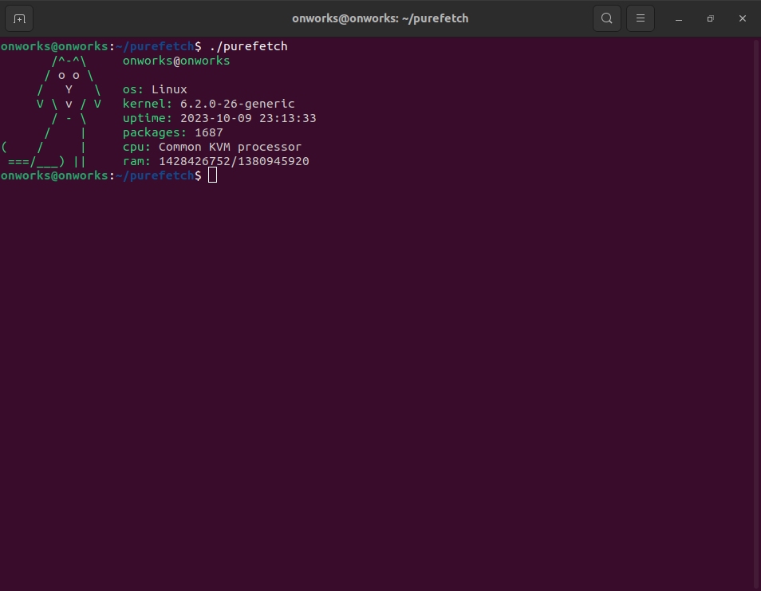

<h1 align="center">Purefetch</h1>
<p align="center">
    
</p>

<h2>Preview: </h2>


<h2>Installation: </h2>

<p>For Ubuntu, Debian (apt):</p>

```bash
$ sudo apt update
$ sudo apt upgrade
$ sudo apt install git python3-pip
$ git clone https://github.com/memb3r/purefetch
$ cd purefetch
$ ./install.sh
```

<p>For Fedora (dnf):</p>

```bash
$ sudo dnf update
$ sudo dnf install git python3-pip
$ git clone https://github.com/memb3r/purefetch
$ cd purefetch
$ ./install.sh
```

<p>For openSUSE (zypper):</p>

```bash
$ sudo zypper refresh
$ sudo zypper install git python3-pip
$ git clone https://github.com/memb3r/purefetch
$ cd purefetch
$ ./install.sh
```

<p>For Arch (pacman):</p>

```bash
$ sudo pacman -Syu
$ sudo pacman -S git python-pip
$ git clone https://github.com/memb3r/purefetch
$ cd purefetch
$ ./install.sh
```

<p>For Void Linux (xbps):</p>

```bash
$ sudo xbps-install -S git python3-pip
$ git clone https://github.com/memb3r/purefetch
$ cd purefetch
$ ./install.sh
```

<h2>Usage:</h2>

```bash
$ ./purefetch
```
