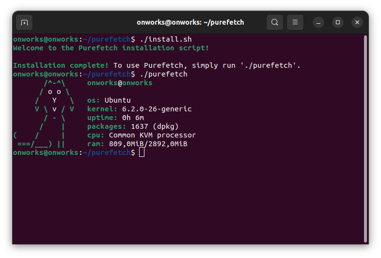

<h1 align="center">Purefetch <sup>1.1</sup></h1>
<p align="center">
    
</p>

<h2>Preview: </h2>
<p align="center"></p>

<h2>Installation: </h2>

<p>For Ubuntu, Debian (apt):</p>

```bash
$ sudo apt install git
$ git clone https://github.com/memb3r/purefetch
$ cd purefetch
$ chmod +x install.sh
$ ./install.sh
```

<p>For Fedora (dnf):</p>

```bash
$ sudo dnf install git
$ git clone https://github.com/memb3r/purefetch
$ cd purefetch
$ chmod +x install.sh
$ ./install.sh
```

<p>For openSUSE (zypper):</p>

```bash
$ sudo zypper install git
$ git clone https://github.com/memb3r/purefetch
$ cd purefetch
$ chmod +x install.sh
$ ./install.sh
```

<p>For Arch (pacman):</p>

```bash
$ sudo pacman -S git
$ git clone https://github.com/memb3r/purefetch
$ cd purefetch
$ chmod +x install.sh
$ ./install.sh
```

<p>For Void Linux (xbps):</p>

```bash
$ sudo xbps-install -S git
$ git clone https://github.com/memb3r/purefetch
$ cd purefetch
$ chmod +x install.sh
$ ./install.sh
```

<p>For Alpine Linux (apk):</p>

```bash
$ sudo apk add git
$ git clone https://github.com/memb3r/purefetch
$ cd purefetch
$ chmod +x install.sh
$ ./install.sh
```

<h2>Usage:</h2>

```bash
$ ./purefetch
```

<h2>Want to make a remix? Read this:</h2>

<p>1. Change "purefetch" to something else.</p>
<p>2. Change ASCII art.</p>
<p>3. In README file, in the end, enter this text:.</p>

```bash
Original Purefetch created by https://github.com/memb3r
```

<h2>Working on (1.1):</h2>
<li><b>Debian and Debian-based</b> (Ubuntu, Zorin OS, Kali Linux, Linux Mint, etc.) ✅</li>
<li><b>Fedora and Fedora-based</b> (openSUSE, CentOS, Oracle Linux, Red Hat, etc.) ✅</li>
<li><b>Arch and Arch-based</b> (Manjaro, SteamOS, etc.)❔</li>
<li><b>Void Linux</b> ✅ <i>(but with bugs)</i></li>
<li><b>Alpine Linux</b> ❔</li>
<li><b>Windows</b> ❌</li>

<br>
<br>
<br>

<p><i>This project was inspired by neofetch and does not have any license.</i></p>
